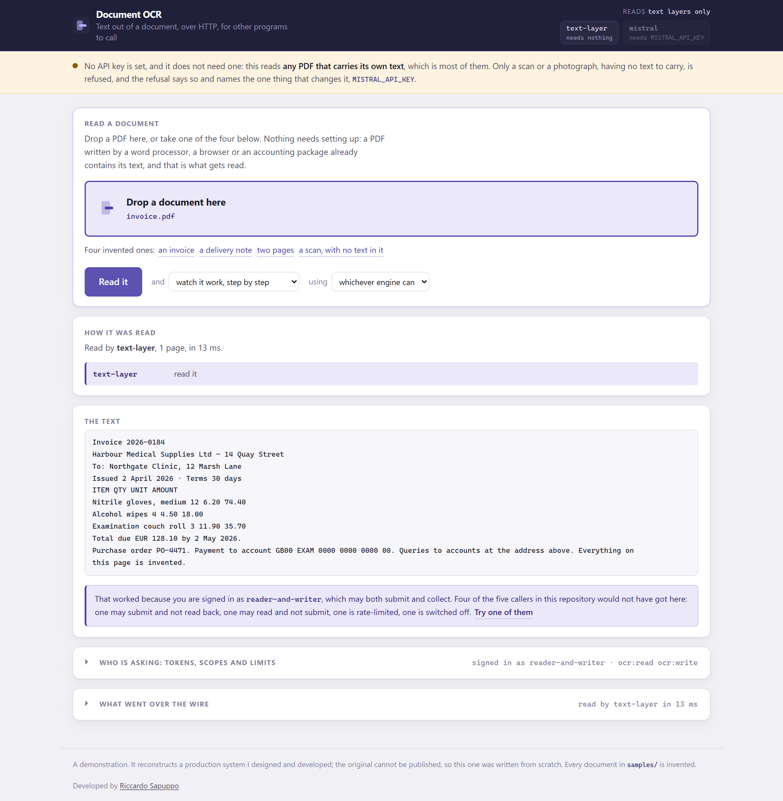
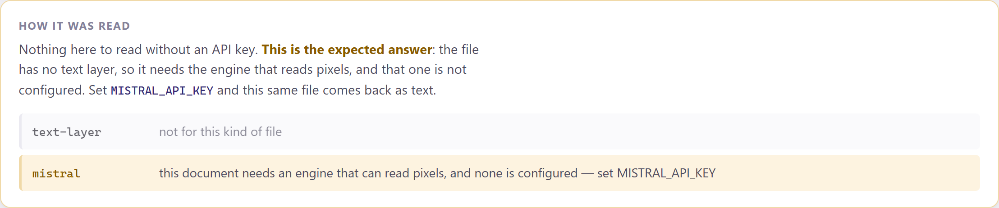
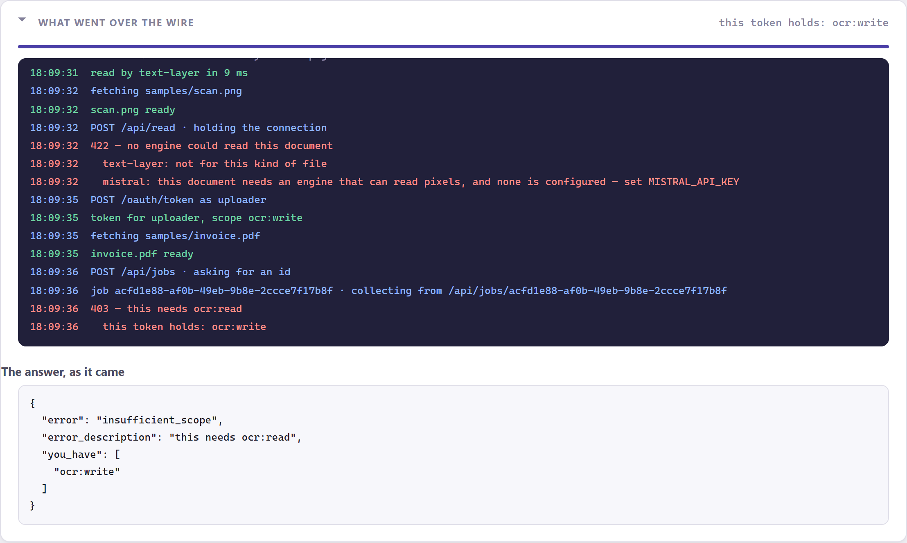
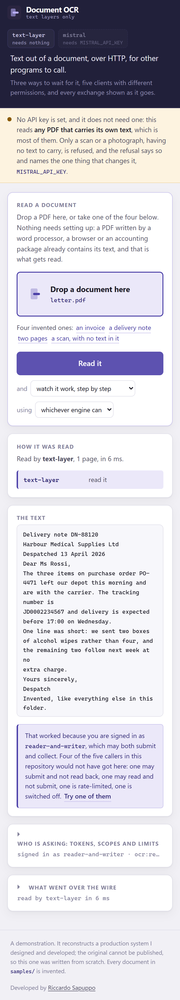

# Document OCR Service

An internal HTTP service that returns the text in an uploaded document, so other
applications can use text recognition without embedding it.

Three ways to ask for the same work — **wait for it**, **watch it happen**, or
**come back for it** — behind OAuth2 client credentials with real scopes and a
rate limit counted per caller.



## The one decision worth arguing about

The service this was rebuilt from sent every file to a hosted model. This one
**reads the text a PDF already contains first**, and only pays to look at pixels
when there is nothing else to read.

A PDF written by a word processor, a browser, an accounting package or a label
printer carries its text. Recognising it from the pixels instead is slower, costs
money per page, and gives a **worse** answer than the one that was already in the
file. Most of what arrives at a service like this is that sort of PDF.

It has a second consequence that matters more here: **this runs with no account
anywhere.** Clone it, start it, and put real documents through it without signing
up for anything. The engine that reads pixels announces itself when it is needed
rather than refusing to start.

```
GET /api/health
{
  "engines": [
    { "name": "text-layer", "needs": "nothing" },
    { "name": "mistral",    "needs": "MISTRAL_API_KEY" }
  ],
  "reads_pixels": false
}
```

The PDF reader is written by hand, in [`src/ocr/pdf-text.js`](src/ocr/pdf-text.js),
against PDFs a browser produced rather than PDFs this repository also produced.
Three things broke on real files and each is a comment in that file now: subset
fonts whose glyph codes are not characters, `Tm` being absolute where `Td` is
relative, and glyph widths — without which a table row arrives as
`Nitrile gloves, medium126.2074.40`.

## Before you start

- **Node 20.11 or newer.** Declared in `engines` and proved by CI, which pins
  exactly that version — see [`.github/workflows/ci.yml`](.github/workflows/ci.yml).
- **Nothing else.** No database, no Docker, no API key, no account. Three
  runtime dependencies: Express, `jsonwebtoken`, `multer`.
- **16 MB** of `node_modules`, measured with `du -sh`, and no network after
  `npm install`. It said "about 30" until somebody measured.
- **A key is optional, and the page proves it rather than promising it.**
  Without `MISTRAL_API_KEY` the service reads any PDF that carries its own text
  — which is most of them — and refuses a scan **with a reason and the name of
  the variable that changes it**. The page says which of the two states it is in
  before you press anything, so the refusal is expected rather than a surprise,
  and `npm run check:screen` asserts both halves of that.
- **To undo it:** delete the folder. Nothing is written outside it.



That is what a refusal looks like here. Not a red error: the documented
state of a service running without a key, said as such, with the one thing
that changes it named in the sentence. The engine chain above it shows why —
the cheap engine passed on a file it is not for, and the expensive one is not
configured.

The browser-driven checks (`check:screen`, `check:mark`, `screenshots`,
`samples`) drive **Microsoft Edge**, already on the machine, through
`playwright-core` — a devDependency, so `npm install` gets it and no browser
is downloaded.

It used to be left uninstalled, on the argument that a check is not a
dependency. It was tidy, and it meant the publication gate could not run two
of the checks the README names — so they ran only when somebody remembered to
run them, which is the arrangement every rule in this repository exists to
avoid. A check nobody can run on a clean clone is a check that has stopped
being one.

## Running it

```
npm install
npm start
```

That is all of it. The page opens by itself on <http://127.0.0.1:3400>, and the
first thing you can do on it is **drop a PDF in and read it** — no key, no
account, nothing to sign up for. Four invented documents are one click away if
you have none to hand.

The token is taken on arrival with the demonstration credentials, so
authenticating is not in front of you. It is not hidden either: the request is
in the transcript with all the others, and the whole permission boundary is a
fold further down, where you can sign in as a client that will refuse you.

> **This is the second version of that page.** The first opened with
> *"1 — Get a token"*, which was the order the API is used in and the wrong
> order for a page: somebody who arrived, dropped a PDF in and was told to
> authenticate first read it as the service demanding a key it had not been
> given. Which is the opposite of the thing this project is for. The API was
> right the whole time — only the page was wrong, and the only way to check the
> order of a page is to arrive at it, so now `npm run check:screen` does.

The browser is not opened in CI, with no terminal attached, or when you say
`--no-open` (or set `NO_OPEN=1`), and it says which of those happened. A
launcher that blocks on a runner turns a green job into one that hangs for six
hours and is quietly cancelled.

```
npm start -- --port 3400 --clients ./config/clients.json --host 127.0.0.1
npm start -- --no-open
```

Localhost unless told otherwise. A service that reads documents somebody has
uploaded and listens on every interface the moment it starts has made a decision
on their behalf.

**3400, not 3000.** That is the port every project on a machine uses in turn, and
this one has already talked to a different project's server left running there —
answering questions about a system it has nothing to do with. A browser also
remembers service workers, storage and permissions per origin, so two projects
sharing a port share state neither knows about.

## The five demonstration clients

Their secrets are in the repository on purpose. This project is a demonstration
of a permission boundary, and a boundary you cannot stand on both sides of is an
assertion rather than a demonstration.

| Client | Secret | What it is for |
|---|---|---|
| `reader-and-writer` | `demo-secret-both-1234` | the everyday caller: submits and collects |
| `uploader` | `demo-secret-write-1234` | may submit and may **not** read back a result |
| `collector` | `demo-secret-read-1234` | may collect and may **not** submit |
| `impatient` | `demo-secret-slow-1234` | three calls a minute, so the limit is visible |
| `retired` | `demo-secret-retired-1234` | switched off in the file; its secret is right and it still gets nothing |

The secrets are stored as SHA-256 hashes in
[`config/clients.json`](config/clients.json), and a client may hold **more than
one**. That is not decoration: rotating means adding the new hash, letting the
caller change over, and removing the old one — three deploys with no window in
which the caller is locked out. With a single secret the rotation is a cut, and
cuts get postponed until the secret is years old.

To add your own: `node tools/hash-secret.mjs "the secret you generated"`.

### The scopes are not a formality

`ocr:write` submits. `ocr:read` collects. They separate because the jobs are
asynchronous: something submits and something polls, and those are often
different processes with different exposure — a public-facing uploader that must
never be able to read back somebody else's result, and a worker that reads and
never submits.

Open **Who is asking** at the bottom of the page, pick `uploader`, and read a
document with *take an id and come back for it*. This is the demonstration,
not a failure of it:



## The three ways

They are the same work — the same engines, the same progress, the same result —
behind three different shapes of promise. A caller picks by how long it can
afford to wait and whether anybody is looking at a screen.

```
POST /api/read         wait for it. Simple, and fine for a text layer.
POST /api/read/live    NDJSON, one line per step. For a person watching.
POST /api/jobs         an id to come back for. For work that takes a while.
GET  /api/jobs/:id     collect it. Needs ocr:read.
```

```bash
TOKEN=$(curl -s -X POST http://127.0.0.1:3400/oauth/token \
  -d grant_type=client_credentials \
  -d client_id=reader-and-writer \
  -d client_secret=demo-secret-both-1234 | node -pe 'JSON.parse(require("fs").readFileSync(0)).access_token')

curl -s -X POST http://127.0.0.1:3400/api/read \
  -H "Authorization: Bearer $TOKEN" \
  -F document=@samples/invoice.pdf
```

The streaming one is NDJSON rather than server-sent events, because the caller is
usually another program: parsing NDJSON needs `split('\n')` where SSE needs a
client library. It sets `X-Accel-Buffering: no`, without which an nginx in front
delivers the whole response at the end — a streaming endpoint that does not
stream and looks like a hung request. Its errors go in the **body**, not the
status, because the status line left with the first byte.

A job answers `202` before the work starts. Keeping a caller waiting for the
answer to a request whose whole point is not waiting gives them the worst of
both.

Every answer carries `X-Request-Id`, the failures included. It is the only thing
a caller can put in a support message.

## Sample documents

`samples/` holds three PDFs and a PNG, all invented, and all **printed by a
browser** rather than written by this project.

That is the point. A PDF reader tested only against PDFs the same repository
produced is a reader tested against its own assumptions: it agrees with itself
about glyph codes, compression and where a line ends, and falls over on the first
file anybody actually has.

| | |
|---|---|
| `invoice.pdf` | a table, which is where spacing goes wrong |
| `letter.pdf` | wrapped paragraphs, which is where line breaks go wrong |
| `two-pages.pdf` | two pages, because a reader that stops at the first looks correct on one |
| `scan.png` | a page with **no text layer at all**, which the first engine has to decline rather than answer with an empty string |

Re-make them with `npm run samples` (wants a browser). They are committed, so
the tests run without one.

## On a phone

<p>
  
</p>

## Checking it

```
npm test               # 64 assertions over the parts
npm run walkthrough    # 39 over HTTP, against a service it starts itself
npm run check:screen   # 24 driving the page with a browser, likewise
npm run check:mark     # the header mark and the tab icon are one drawing
npm run screenshots    # retakes the pictures above
```

Three layers, because a check at one cannot see the next.

**`npm test`** covers the reading, the client file, the tokens, the rate limit
and the jobs. Time is injected everywhere: a test that proves a fifteen-minute
expiry by waiting fifteen minutes does not get run, and one that proves it by
waiting a second gets marked flaky and deleted. It found two defects rather than
the other way round — `kept_until` was `job.finishedAt ? … : null`, so a job that
finished at the epoch reported that it never had; and the token issuer took an
injected clock and used it for the three fields it printed while `expiresIn` was
still measured from the real one.

**`npm run walkthrough`** is the check not written behind the same door as the
code. Half of it is about what must **not** work: a write-only client that
cannot read back what it submitted, a read-only client that cannot collect
somebody else's job, a switched-off client whose secret is right, a rate limit
that catches one caller and not the next. It edits the client file to prove the
reload happens without a restart, and puts it back exactly as it found it —
a check that leaves its scaffolding behind eventually accuses the service of its
own mess.

**`npm run check:screen`** drives the page. Two things live only there: the
NDJSON reader, whose every defect is invisible from the server side because a
chunk boundary lands wherever the network put it and routinely in the middle of a
line; and the refusals, which are the reason the scopes exist and which a person
should be able to provoke in two clicks.

## One file to copy onto a server

```
npm run build:binary
```

The original shipped with `pkg`, which is no longer maintained. Node has since
grown the capability itself, so this uses that — the same idea with nothing
unmaintained in the chain.

Two steps. The first bundles everything into `dist/service.cjs`, which runs
anywhere Node does and is already useful. The second glues that into a copy of
the Node binary, and **can only build for the platform it runs on**: an
executable is the host Node with a blob inside it. On Windows and macOS the
script says so and stops after step one; CI builds the Linux binary on every
push, which is how the claim above stays true rather than being asserted once.

The client file and the samples stay **outside** the binary. They are
configuration and data, and a service whose list of callers is baked into the
executable cannot have one added without a rebuild — which is the whole thing the
reloading client file exists to avoid.

## Where things are

```
src/
  index.js           reads the flags, starts it, stops it politely
  server.js          the routes: the three ways, and the guard in front of them
  auth/
    clients.js       who may call, from a file re-read while it runs
    tokens.js        client credentials, and the two scopes
    rate.js          a sliding window, per client
  ocr/
    engines.js       which engine gets a document, and what each one said
    pdf-text.js      the PDF text layer, by hand
    mistral.js       the hosted engine, with timeouts and spread-out retries
  jobs/store.js      jobs that outlive the request, and stop being kept
public/              the control panel: no framework, no build step
tools/               the checks not written behind the same door
samples/             four documents a browser printed
```

## What this is not

- **The jobs are in memory.** A job that must survive a restart wants a queue,
  a broker and a worker, which is the right answer for a busy deployment and not
  the subject here. Everything else is stateless.
- **The rate limit is per process.** Behind two copies the quota is per copy.
  Sharing it wants Redis, and saying so is better than implying otherwise.
- **The text layer engine gives up on** encrypted PDFs, CID fonts with no
  `ToUnicode` map, and text drawn as vector outlines. Each returns "no text layer
  here", which sends the document to the engine that reads pixels.
- **Nothing is stored about a document** once its job has been thrown away.
  There is no history, and no way to ask what was uploaded yesterday.

## Licence

MIT. See [LICENSE](LICENSE).

Developed by Riccardo Sapuppo.
